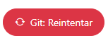
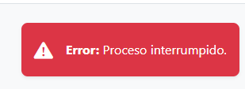
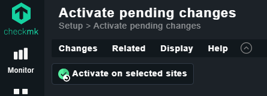
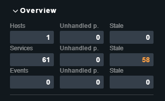
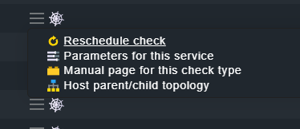

# Guión para demo de edugtiops

## Preparación del entorno

Antes de comenzar la demo.

```bash
cd edugitops

# Arranca un entorno limpio
make start-minikube
kubectl delete-stak
make stack

# Espera a que todos los pods están READY 1/1 (t: 117s)
kubectl get pods --all-namespaces
make expose
```

### GITEA

- GITEA: navegador http://localhost:3000/ 
Login: u:admin p: admin123

```bash
make gitea-init
```

- GITEA: muestra repositorio admin/demo-tfm

### ARGOCD

```bash
make expose
make passwords
```

- ARGOCD: navegador http://localhost:8080/ Login: credenciales en termimal

### CHECKMK

```bash
make expose
```

CHECKMK:  navegador http://localhost:5000/
Login con:  u: cmkadmin  p: admin123

### APP-EDUGITOPS

```bash
make expose
```

APP-EDUGITOPS: Navegador http://localhost:5001/

- Borra todos los laboratorios de *alumno-juan*
- Guardar + Push

Sincroniza argocd

```bash
make sincro
```

## Laboratorio GRAFANA + PROMETHEUS y CODE-SERVER

- APP-EDUGITOPS: Con *alumno-juan* seleccionado marca los laboratorios GRAFANA, PROMETHEUS y CODE-SERVER
- APP-EDUGITOPS: Guardar + Push  (t:6s)
- ARGOCD: Muestra la sincronización de *alumno-juan*
- CHECKMK: Muestra la monitorización
- APP-EDUGITOPS: Abre la vista DESPLIEGUES
  - GRAFANA: Copia comando port-forward, ejécutalo en terminal y abre la URL mostrada. Login: u: admin p: admin
  - CODE-SERVER: Copia comando port-forward, ejécutalo en terminal y abre la URL mostrada.

## Laboratorio BBDD

- APP-EDUGITOPS
  - Crea un nuevo usuario *alumno-ana* y marca POSTGRESQL, MYSQL y MONGODB
  - Guardar + Push
- ARGOCD: Muestra la sincronización de *alumno-ana* (t: 10s)
- CHECKMK: Muestra la monitorización de BBDD
- APP-EDUGITOPS
  - Abre la vista DESPLIEGUES
  - Copia comando port-forward de POSTGRESQL y ejecútalo en la terminal.
  - En otra terminal ejecuta el siguiente comando (sustituye el puerto)

```bash
psql -h 127.0.0.1 -p 31473 -U postgres
q
\q
```

## LIMPIEZA LABORATORIO

- APP-EDUGITOPS
  - Borra *alumno-ana*
  - Guardar + Push
- ARGOCD: Muestra el borrado de alumno-ana
- CHECKMK: Muestra la monitorización

## DESPLIEGUE MASIVO

- APP-EDUGITOPS
  - Abre el Editor YAML
  - Sustituye el contenido por el fichero **alumnos-50.yaml** y Guarda.
  - Guardar + Push
  - Muestra las opciones de búsqueda de APP-EDUGITOPS por nombre y por id.
- ARGOCD
  - Visualiza la sincronización
  - Muestra la vista del sumario (no hace falta esperar a que estén todos desplegados).
- CHECKMK: Mostrar la monitorización
- APP-EDUGITOPS
  - Mostrar la vista de despliegue
  - Copia comando port-forward y ejecútalo en la terminal.
  - Abre la url de la terminal

## Problemas conocidos

### Problemas de APP-EDUGITOPS

#### Sin conexión con GITEA

Si se muestra el botón de "Git: Reintentar" arriba a la derecha en rojo, púlsalo para que vuelva a reintentar la conexión.


Si no recarga hay un problema con GITEA, comprueba que se visualiza y que está el repositorio *demo-tfm* cargado.

#### No hay alumnos

Si se borran todos los alumnos y se pulsa Guardar + Push se muestra este error. Se soluciona creando al menos un alumno.


### Problemas de ARGOCD

Si no muestra los cambios pulsar el botón REFRESH.

### Problemas con CHECKMK

#### Pendiente de aplicar los cambios

Si se muestra un icono amarillo arriba a la derecha y no se muestra lo que debería sincronizar, es porque los cambios no se han aplicado.


- Pulsa el icono amarillo
- Pulsa el botón arriba a la izquierda con el texto **Activate on selected sites**

- Cuando finalice pulsa sobre el número de **services** en el cuadro arriba a la derecha


#### Monitorización gris

Si en el Checkmk se muestra los servicios monitorizado en gris y con un icono de tela de araña es porque aún no le ha dado tiempo a realizar el check. Se puede forzar pulsando el icono de las tres líneas horizontales y pulsando sobre **Reschedule check**



